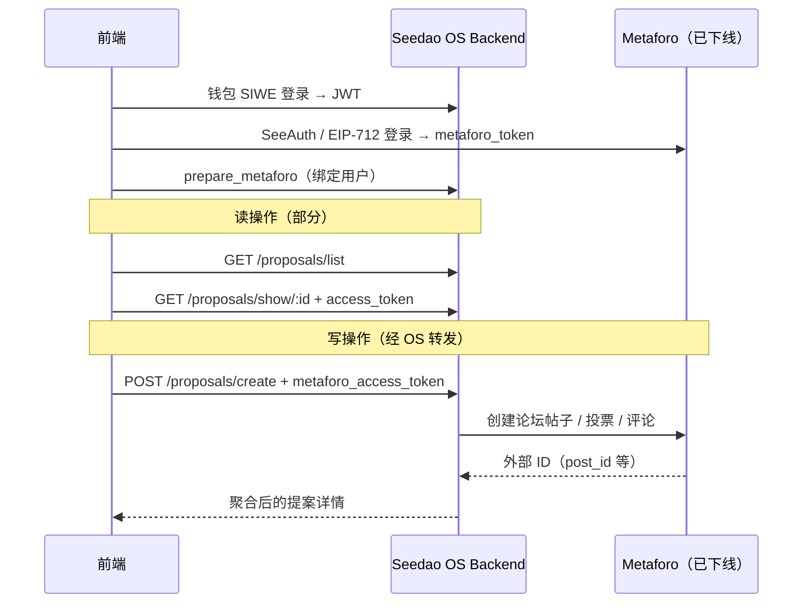
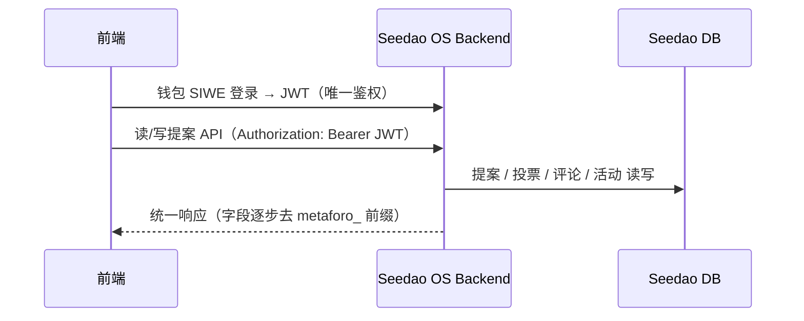
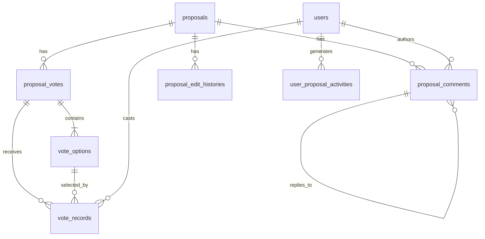
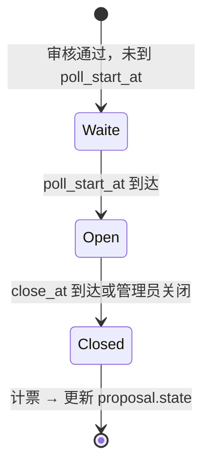

# 提案与投票系统后端重构方案（去 Metaforo 化）

> **文档版本**：v0.1  
> **编写依据**：`seedao-app` 前端现有 API 调用与类型定义（`src/requests/proposalV2.ts`、`src/type/proposalV2.type.ts`）  
> **目标读者**：OS Backend 开发、DBA、架构评审  
> **状态**：待评审可行性

---

## 1. 背景与动机

Metaforo 论坛服务已停止维护并关闭。当前 SeeDAO 提案系统（Proposal V2）在架构上采用 **「Seedao OS 后端 + Metaforo 论坛」双系统协作**：

- **Seedao OS 后端**：维护提案元数据、状态机、权限、列表查询等；
- **Metaforo**：承担提案发布、投票记录、评论帖子、用户活动流等「论坛侧」读写。

前端在完成钱包登录（Seedao JWT）后，还需二次登录 Metaforo 获取 `metaforo_access_token`，并在几乎所有写操作中将其传给后端，由后端转发至 Metaforo。

该模式在 Metaforo 下线后将完全不可用。重构目标是：

1. **投票、评论、提案提交等数据全部存入 Seedao 自有数据库**；
2. **写操作仅依赖 Seedao JWT（钱包登录）鉴权**，移除 `metaforo_access_token`；
3. **保持前端 API 路径与响应结构尽量兼容**，降低前端改造成本；
4. **支持历史数据迁移**（若需要保留旧提案的投票/评论记录）。

---

## 2. 现状架构（As-Is）



### 2.1 前端当前依赖 Metaforo 的接口

| 分类 | 接口 | Metaforo 相关参数 |
|------|------|-------------------|
| 用户绑定 | `POST /user/prepare_metaforo` | `api_token`, `user.id` |
| 活动流 | `GET /user/metaforo_activities` | `metaforo_access_token`, `userId` |
| 提案详情 | `GET /proposals/show/:id` | `access_token`（query） |
| 创建/更新 | `POST /proposals/create`、`/update/:id` | `metaforo_access_token`；`submit_to_metaforo` |
| 投票 | `POST /proposals/vote/:id`、`/can_vote/:id`、`/close_vote/:id` | `metaforo_access_token`（vote/close） |
| 评论 | `POST /proposals/add_comment/:id`、`/edit_comment/:id`、`/delete_comment/:id` | `metaforo_access_token`；`reply_id` 为 Metaforo post id |
| 审核 | `POST /proposals/approve/:id`、`/reject/:id` | `metaforo_access_token` |

### 2.2 前端当前数据模型中的 Metaforo 字段

| 字段 | 出现位置 | 含义 |
|------|----------|------|
| `metaforo_post_id` | 评论 | 论坛帖子 ID，兼作分页游标 |
| `reply_metaforo_post_id` | 评论 | 父评论的论坛帖子 ID |
| `reject_metaforo_comment_id` | 提案详情 | 驳回时置顶评论 ID |
| `metaforo_id` | 提案分类 | 论坛分类映射 |
| `metaforo_action` | 用户活动 | 活动类型（create/comment/vote/share） |
| `metaforo_access_token` | 所有写请求 | 论坛鉴权令牌 |
| `submit_to_metaforo` | 创建/更新 | 是否同步发布到论坛 |

### 2.3 提案状态机（前端已约定，后端应保持一致）

```
pending_submit → draft → approved → voting → vote_passed / vote_failed
                ↓           ↓                      ↓
            withdrawn    rejected            pending_execution → executed / execution_failed
                                                      ↓
                                                   vetoed
```

### 2.4 投票类型（`vote_type`）

| 值 | 含义 |
|----|------|
| `0` | 无投票 |
| `1` | 赞成/反对 |
| `2` | 预定义百分比选项 |
| `98` / `99` | 自定义投票选项 |

另支持 `is_multiple_vote`（多选）与 `vote_gate`（NFT 合约门控，含 `contract_addr`、`token_id`）。

---

## 3. 目标架构（To-Be）



**核心原则**：

1. **Single Auth**：写操作身份 = JWT 中的 `wallet`，不再接受 `metaforo_access_token`；
2. **Self-Contained**：投票计票、评论树、活动流均在 OS DB 内完成；
3. **Backward Compatible**：优先保持 URL 路径与响应 JSON 结构不变，字段可做别名过渡期；
4. **Explicit State**：`submit_to_metaforo` 语义改为「提交审核/发布」，不再触发外部同步。

---

## 4. 建议数据模型

以下为建议表结构，供后端评审。实际表名/字段可与现有 schema 合并。

### 4.1 核心表关系



### 4.2 表结构建议

#### `proposals`（已有，增补/清理）

| 字段 | 类型 | 说明 |
|------|------|------|
| `id` | bigint PK | 提案 ID（即 SIP 序号来源） |
| `title` | varchar | 标题 |
| `applicant` | varchar | 发起人钱包 |
| `state` | enum | 见 §2.3 |
| `proposal_category_id` | int FK | 分类 |
| `vote_type` | tinyint | 见 §2.4 |
| `is_multiple_vote` | bool | 是否多选 |
| `template_id` | int | 模板 |
| `content_blocks` | json | 正文块 |
| `components` | json | 动态组件数据 |
| `sip` | int | SIP 编号（可冗余） |
| `reject_reason` | text | 驳回原因 |
| `reject_comment_id` | bigint nullable | 驳回置顶评论（替代 `reject_metaforo_comment_id`） |
| `execution_ts` | int | 执行时间戳 |
| `arweave` | varchar nullable | 存档哈希（若仍使用 Arweave 可保留） |
| `metaforo_thread_id` | bigint nullable | **废弃**，迁移期只读 |

#### `proposal_votes`（投票轮次 / Poll）

| 字段 | 类型 | 说明 |
|------|------|------|
| `id` | bigint PK | 对应前端 `Poll.id` |
| `proposal_id` | bigint FK | |
| `title` | varchar | 投票标题 |
| `poll_start_at` | datetime | 开始时间 |
| `close_at` | datetime | 结束时间 |
| `show_type` | tinyint | 结果展示方式 |
| `status` | enum | `waite` / `open` / `close`（可由时间推导） |
| `vote_gate_contract` | varchar nullable | NFT 门控合约 |
| `vote_gate_token_id` | int nullable | NFT token id |
| `arweave` | varchar nullable | 投票结果存档 |

#### `vote_options`

| 字段 | 类型 | 说明 |
|------|------|------|
| `id` | bigint PK | 对应前端 `VoteOption.id` |
| `vote_id` | bigint FK | |
| `html` | text | 选项文案 |
| `sort_order` | int | 排序 |
| `voter_count` | int | 投票人数（冗余） |
| `weight_sum` | decimal | 权重合计（冗余） |

#### `vote_records`（核心新增）

| 字段 | 类型 | 说明 |
|------|------|------|
| `id` | bigint PK | |
| `proposal_id` | bigint FK | |
| `vote_id` | bigint FK | |
| `option_id` | bigint FK | 单选一条；多选多条 |
| `wallet` | varchar | 投票人 |
| `weight` | decimal | 投票权重 |
| `created_at` | datetime | |

**唯一约束建议**：

- 单选：`UNIQUE(vote_id, wallet)`；
- 多选：`UNIQUE(vote_id, wallet, option_id)`。

#### `proposal_comments`

| 字段 | 类型 | 说明 |
|------|------|------|
| `id` | bigint PK | 替代 `metaforo_post_id` |
| `proposal_id` | bigint FK | |
| `parent_id` | bigint nullable | 替代 `reply_metaforo_post_id`，0 或 NULL 表示顶级 |
| `wallet` | varchar | 作者 |
| `content` | text | Quill JSON 字符串 |
| `editor_type` | tinyint | 前端固定传 `0` |
| `is_deleted` | bool | 软删除 |
| `created_at` | datetime | |
| `updated_at` | datetime | |
| `metaforo_post_id` | bigint nullable | **迁移期保留**，便于对账 |

#### `user_proposal_activities`（替代 metaforo_activities）

| 字段 | 类型 | 说明 |
|------|------|------|
| `id` | bigint PK | |
| `wallet` | varchar | 活动所属用户 |
| `action_type` | enum | `create` / `comment` / `vote` / `share` |
| `proposal_id` | bigint | |
| `target_title` | varchar | 提案标题快照 |
| `reply_to_wallet` | varchar nullable | 评论对象钱包 |
| `action_ts` | int | Unix 时间戳 |

#### `proposal_categories`（清理）

- `metaforo_id` 字段标记废弃，不再参与业务逻辑；
- 分类权限继续用 `has_perm` / `list_with_perm` 机制。

---

## 5. API 改造方案

### 5.1 废弃接口

| 接口 | 处理方式 |
|------|----------|
| `POST /user/prepare_metaforo` | **下线**，返回 410 或短期 404 |
| `GET /user/metaforo_activities` | **下线**，由新接口替代 |

### 5.2 新增接口

#### `GET /user/proposal_activities`

替代 `metaforo_activities`，仅依赖 JWT。

**请求参数**：

```json
{
  "size": 10,
  "session": "cursor_string_optional"
}
```

**响应**（与旧结构对齐，字段改名）：

```json
{
  "code": 200,
  "data": {
    "records": [
      {
        "action_ts": 1730448000,
        "action_type": "comment",
        "proposal_id": 358,
        "target_title": "SIP-358: ...",
        "wallet": "0x...",
        "reply_to_wallet": "0x..."
      }
    ],
    "session": "next_cursor"
  }
}
```

> 迁移期可同时返回 `metaforo_action` 作为 `action_type` 的别名，便于前端灰度。

### 5.3 改造接口明细

#### 5.3.1 `GET /proposals/show/:id`

| 变更项 | 说明 |
|--------|------|
| 移除 `access_token` query | 评论读取不再需要 Metaforo token |
| `start_post_id` → `start_comment_id` | 评论分页游标改为自有 comment id；**迁移期两者并存，优先新字段** |
| 响应 `comments[].metaforo_post_id` | 改为 `comment_id`，迁移期双写 |
| 响应 `comments[].reply_metaforo_post_id` | 改为 `parent_comment_id` |
| 响应 `reject_metaforo_comment_id` | 改为 `reject_comment_id` |
| `votes[]` 聚合 | 从 `vote_options` + `vote_records` 实时或准实时计算 `percent`、`voters`、`weights`、`is_vote` |

**`is_vote` / `can_vote` 计算（列表与详情均需）**：

- `can_vote`：当前用户满足投票资格（时间窗口、state=voting、未投过、NFT gate 等）；
- `is_voted`：当前用户在 `vote_records` 中已有记录；
- `Poll.is_vote` / `VoteOption.is_vote`：当前用户是否投了该 poll / 该 option。

#### 5.3.2 `POST /proposals/create` & `POST /proposals/update/:id`

| 变更项 | 说明 |
|--------|------|
| 移除 `metaforo_access_token` | 鉴权仅用 JWT |
| `submit_to_metaforo` → `submit` | 语义：`true` = 提交审核（`pending_submit` → 进入审核流），`false` = 保存草稿 |
| 创建投票 | 若模板带 `vote_type`，在 DB 创建 `proposal_votes` + `vote_options` |
| 不再调用 Metaforo 发帖 | 审核通过后由 OS 自行将 state 推进入 `voting` 并设置 `poll_start_at` / `close_at` |

**请求体示例（目标形态）**：

```json
{
  "title": "...",
  "proposal_category_id": 12,
  "vote_type": 1,
  "is_multiple_vote": false,
  "vote_options": null,
  "content_blocks": [],
  "components": [],
  "template_id": 5,
  "submit": true
}
```

#### 5.3.3 `POST /proposals/can_vote/:id`

- 仅 JWT，返回 `boolean`；
- 校验项建议：
  1. `state == voting`；
  2. 当前时间在 `[poll_start_at, close_at)`；
  3. 用户未在 `vote_records` 中投过（多选按业务规则）；
  4. `vote_gate` NFT 持有（若配置）；
  5. Casbin / 白名单 / SBT 等既有权限规则。

#### 5.3.4 `POST /proposals/vote/:id`

| 变更项 | 说明 |
|--------|------|
| 移除 `metaforo_access_token` | |
| 保留 `vote_id`、`options[]` | `options` 为 `vote_options.id` 数组 |
| 写入 `vote_records` | 计算 `weight` 后入库 |
| 更新聚合字段 | `vote_options.voter_count`、`weight_sum`；可选异步 |
| 写 `user_proposal_activities` | `action_type = vote` |
| 幂等 | 重复投票返回明确错误码 |

**响应**：可返回更新后的 poll 快照，或仅 `{ success: true }`（前端当前会重新 `getProposalDetail`）。

#### 5.3.5 `POST /proposals/close_vote/:id`

- 管理员/治理权限关闭投票；
- 更新 `proposal_votes.status` → `close`，并驱动提案 state 流转（`vote_passed` / `vote_failed`）；
- 移除 `metaforo_access_token`。

#### 5.3.6 `GET /proposals/vote_detail/:option_id`

- 从 `vote_records` 分页查询；
- 响应保持 `{ wallet, os_avatar, weight }` 结构。

#### 5.3.7 评论接口

| 接口 | 变更 |
|------|------|
| `POST /proposals/add_comment/:id` | `reply_id` 语义改为 `parent_comment_id`；移除 token；写入 `proposal_comments` |
| `POST /proposals/edit_comment/:id` | `post_id` → `comment_id` |
| `POST /proposals/delete_comment/:id` | 软删除；`post_id` → `comment_id` |

评论树组装逻辑由后端完成（`children` 嵌套），与现前端 `IComment` 结构一致。

#### 5.3.8 `POST /proposals/approve/:id` & `POST /proposals/reject/:id`

- 移除 `metaforo_access_token`；
- `reject` 时若需置顶评论，创建一条系统/审核人评论并写 `reject_comment_id`；
- `approve` 后按模板规则初始化投票计划（立即投票 / 定时开始）。

#### 5.3.9 只读接口（基本不变）

以下接口理论上无需 Metaforo，确认无隐藏依赖即可：

- `GET /proposals/list`
- `GET /proposals/my`
- `GET /proposal_categories/list`
- `GET /proposal_categories/list_with_perm`
- `GET /proposal_tmpl/list_with_perm`
- `GET /proposal_components/`
- `POST /proposals/withdraw/:id`

---

## 6. 投票业务逻辑（需后端明确实现）

### 6.1 投票生命周期



建议由 **定时任务**（每分钟）或 **请求时惰性检查** 驱动状态迁移。

### 6.2 计票与结果

| 场景 | 处理 |
|------|------|
| 赞成/反对（type=1） | 按权重比较 |
| 百分比选项（type=2） | 权重最高者胜 |
| 自定义选项（98/99） | 同上 |
| 多选 | 每个 option 独立计票；前端展示多条 `vote_records` |
| `show_type` | 控制投票进行中是否公开中间结果 |

### 6.3 权重计算（待确认）

原 Metaforo 可能支持二次方投票（quadratic voting）。需产品/后端确认：

- [ ] 是否仍为 **1 地址 1 票（权重=1）**？
- [ ] 是否按 **SBT / NFT / SCR** 加权？
- [ ] `vote_gate` 是硬性门槛还是权重加成？

**建议在 `vote_records.weight` 写入最终权重，便于审计与导出。**

### 6.4 投票结束后的提案状态

| 结果 | proposal.state |
|------|----------------|
| 通过 | `vote_passed` → `pending_execution` → `executed` |
| 未通过 | `vote_failed` |
| 否决提案模板 | `vetoed` |

---

## 7. 评论业务逻辑

### 7.1 分页策略

**现状**：`GET /proposals/show/:id?start_post_id={last_metaforo_post_id}` 加载下一批评论。

**建议**：

```
GET /proposals/show/:id?start_comment_id={last_comment_id}&comment_limit=20
```

- 首次不传 `start_comment_id`，返回最新或最早 N 条（需与现网行为一致，建议 **正序、每次 20 条**）；
- 返回 `comment_count` 总量；
- 前端根据 `comments.length < comment_count` 判断是否 `hasMore`。

### 7.2 评论版本 / Arweave

评论组件展示 `proposal_arweave_hash`、`proposal_title`、`proposal_ts`（编辑历史相关）。若 Arweave 存档仍保留，需在评论或编辑历史变更时更新对应字段；若不再使用，可返回空值，前端会隐藏版本入口。

---

## 8. 历史数据迁移

### 8.1 迁移范围

| 数据 | 优先级 | 说明 |
|------|--------|------|
| 提案主表 | P0 | OS DB 应已有 |
| 投票记录 | P0 | 若仅存于 Metaforo，需从备份/API 导出导入 `vote_records` |
| 评论 | P1 | `metaforo_post_id` → `proposal_comments.id` 映射表 |
| 用户活动 | P2 | 可只迁移近 N 个月 |
| SIP 编号 | P0 | 保持 `sip` 与 `id` 映射不变 |

### 8.2 建议迁移步骤

1. **冻结**：停止 Metaforo 写入（已完成）；
2. **导出**：从 Metaforo 备份或 OS 中间表导出 post/vote 数据；
3. **映射**：建立 `legacy_metaforo_post_id → comment_id` 对照表；
4. **导入**：批量写入 `proposal_comments`、`vote_records`；
5. **校验**：按提案抽样对比 `comment_count`、总票数；
6. **双读期**：API 同时返回 `metaforo_post_id` 与 `comment_id`（值相同或为映射值）；
7. **切换**：前端改用新字段后，移除别名。

### 8.3 无法迁移时的降级

- 旧提案：投票/评论只读快照（JSON 归档），不再允许新操作；
- 新提案：全部走新表。

---

## 9. 兼容性策略（前后端联调）

建议分三阶段，降低一次性风险：

| 阶段 | 后端行为 | 前端行为 |
|------|----------|----------|
| **Phase A** | 接受但**忽略** `metaforo_access_token`；仍返回旧字段名 | 可不改 |
| **Phase B** | 响应**双写字段**（`metaforo_post_id` + `comment_id`） | 逐步改用新字段 |
| **Phase C** | 移除 Metaforo 字段与废弃接口 | 移除 Metaforo 登录 |

**错误码建议**：

| code | 含义 |
|------|------|
| `401` | JWT 无效 |
| `403` | 无投票/审核权限 |
| `409` | 重复投票 |
| `422` | 投票未开放 / 选项非法 |
| `410` | 接口已废弃（prepare_metaforo） |

---

## 10. 关联系统影响（非 Proposal V2 主路径）

以下模块也引用 Metaforo / 旧论坛，**不在本次 P0 范围**，但后端需评估：

| 模块 | 现状 | 建议 |
|------|------|------|
| 治理节点结果页 | `metaforo_credit`、`metaforo_vote_count` | 改为从 `vote_records` 统计，字段重命名 |
| 项目/公会关联提案 | 链接解析 `forum.seedao.xyz/thread/sip-*` | 改为 `/proposal/thread/:id` |
| 旧 Proposal V1 页面 | 直连 `forum.seedao.xyz` API | 可下线或只读归档 |
| Arweave 存档 | 提案/投票/编辑历史 | 可保留为审计层，与 DB 双写或异步写 |

---

## 11. 实施排期建议

| 阶段 | 内容 | 预估 | 产出 |
|------|------|------|------|
| **P0-设计** | 确认权重规则、迁移范围、表结构评审 | 3–5 天 | ER 图、API diff 文档 |
| **P1-数据层** | 建表、迁移脚本、聚合查询 | 5–8 天 | 新表 + 迁移报告 |
| **P2-写路径** | vote / comment / create / approve 改造 | 8–12 天 | 写接口可联调 |
| **P3-读路径** | show 详情聚合、列表 is_voted/can_vote | 3–5 天 | 详情页可联调 |
| **P4-活动流** | proposal_activities、治理统计字段 | 2–3 天 | 历史 Tab 可用 |
| **P5-清理** | 下线 Metaforo 集成代码与字段 | 2–3 天 | 技术债清理 |

**前后端可并行**：P1 完成后，前端即可开始移除 Metaforo 登录（Phase A 兼容模式）。

---

## 12. 风险与待确认问题

请后端评审时重点回复以下问题：

### 12.1 数据与迁移

1. OS DB 中 **是否已存部分投票/评论数据**，还是完全依赖 Metaforo？
2. Metaforo 是否有 **可导出的最终备份**？数据格式？
3. 历史提案是否要求 **投票记录 100% 可溯**？

### 12.2 业务规则

4. 投票 **权重算法** 与 Metaforo 时期是否必须一致？
5. `vote_gate` NFT 校验是否 **链上实时查询**？失败降级策略？
6. 审核通过后，投票时间是 **立即开始** 还是由管理员/规则配置？
7. `close_vote` 哪些角色可调用？是否仅「否决提案」模板？

### 12.3 技术

8. 投票聚合是 **实时 SQL** 还是 **Redis 缓存 + 定时落库**？
9. 评论量大时，`show` 接口是否拆分为 `GET /proposals/:id/comments` 独立分页？
10. 是否需要 **事件/outbox** 通知下游（执行引擎、积分、治理节点统计）？

### 12.4 接口兼容

11. 是否接受 **Phase A 忽略 metaforo_access_token** 的灰度方案？
12. `submit_to_metaforo` 是否保留字段名仅改语义，还是同步改为 `submit`？

---

## 13. 验收标准（建议）

| # | 场景 | 预期 |
|---|------|------|
| 1 | 钱包登录后创建并提交提案 | 无需 Metaforo 登录，state 正确 |
| 2 | 审核通过进入投票期 | `poll_start_at` / `close_at` 正确 |
| 3 | 合格用户投票 | `vote_records` 有记录，详情 `is_vote=1` |
| 4 | 重复投票 | 返回 409，数据不变 |
| 5 | 无权限用户 | `can_vote=false`，投票返回 403 |
| 6 | 发表评论/回复 | 评论树正确，`comment_count` 递增 |
| 7 | 评论分页 | `start_comment_id` 游标正确 |
| 8 | 投票结束 | state 自动变为 `vote_passed` 或 `vote_failed` |
| 9 | 用户活动流 | `proposal_activities` 含 create/comment/vote |
| 10 | 历史提案 | 迁移数据可查看，票数与备份一致（±约定误差） |

---

## 14. 附录：前端将配合的改动（供评估工作量）

后端按本文改造完成后，前端预计改动：

- 删除 Metaforo 登录模块（`useMetaforoLogin`、Modal、`loginToMetafo` 等）；
- `proposalV2.ts` 移除所有 `metaforo_access_token`；
- 类型字段 `metaforo_*` → `comment_id` / `action_type` 等；
- 评论分页参数 `start_post_id` → `start_comment_id`；
- 投票/评论操作前仅检查钱包登录。

**前端不改 UI 交互**，用户感知为「登录钱包即可提案和投票」。

---

## 15. 文档修订记录

| 版本 | 日期 | 说明 |
|------|------|------|
| v0.1 | 2026-06-09 | 初稿，基于 seedao-app 前端代码梳理 |

---

**联系人**：前端团队（本文档由前端根据现有调用链整理，具体表结构与权重规则以后端评审结论为准。）
